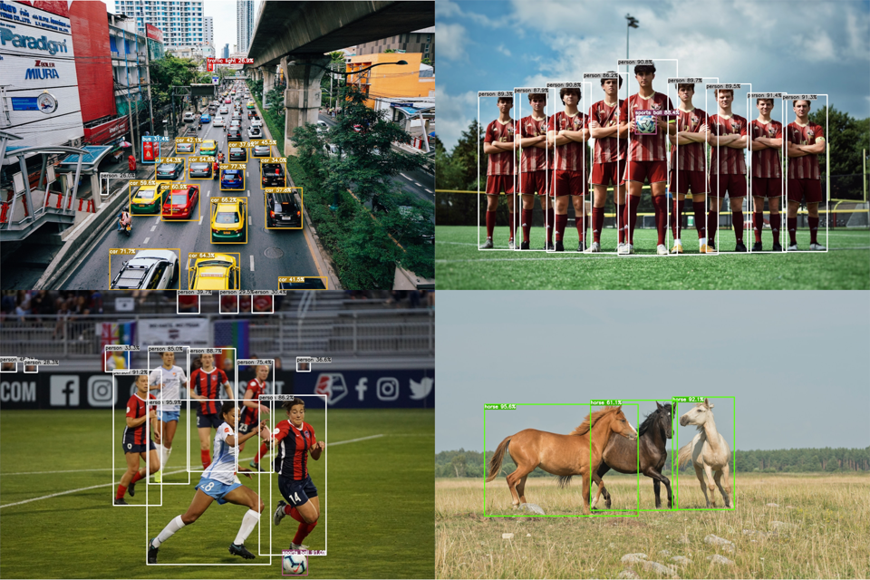

[![Stargazers][stars-shield]][stars-url]
[![Issues][issues-shield]][issues-url]
[![LinkedIn][linkedin-shield]][linkedin-url]

<!-- PROJECT LOGO -->
 

  
  <h3 align="center">YoloV8 TensorRT CPP</h3>
  

    <b>
    A C++ Implementation of YoloV8 using TensorRT
    </b>

[//]: # (     )
[//]: # (    Supports models with single / multiple inputs and single / multiple outputs with batching.)
[//]: # (     )
[//]: # (     )
[//]: # (    <a href="https://www.youtube.com/watch?v=kPJ9uDduxOs">Project Overview Video</a>)
[//]: # (    .)
[//]: # (    <a href="https://youtu.be/Z0n5aLmcRHQ">Check of </a>)

  

### Getting Started
This project demonstrates how to use the TensorRT C++ API to run GPU inference for the YoloV8. 
It makes use of my other project [tensorrt-cpp-api](https://github.com/cyrusbehr/tensorrt-cpp-api) to run inference behind the scene, so make sure you are familiar with that project.

### Prerequisites
- Install CUDA, instructions [here](https://developer.nvidia.com/cuda-11.2.0-download-archive).
    - Recommended >= 11.2
- Install cudnn, instructions [here](https://docs.nvidia.com/deeplearning/cudnn/install-guide/index.html#download).
    - Recommended >= 8
- `sudo apt install build-essential`
- `sudo apt install python3-pip`
- `pip3 install cmake`
- Install OpenCV with cuda support. Instructions can be found [here](https://gist.github.com/raulqf/f42c718a658cddc16f9df07ecc627be7).
- Download TensorRT 8 from [here](https://developer.nvidia.com/nvidia-tensorrt-8x-download).
    - Recommended >= 8.2
- Extract, and then navigate to the `CMakeLists.txt` file and replace the `TODO` with the path to your TensorRT installation.

### Installation
- `git clone https://github.com/cyrusbehr/YOLOv8-TensorRT-CPP --recursive`
- **Note:** Be sure to use the `--recursive` flag as this repo makes use of git submodules. 

### Converting Model from PyTorch to ONNX

- Navigate to the [official YoloV8 repository](https://github.com/ultralytics/ultralytics) and download your desired version of the model (ex. YOLOv8m).
- `pip3 install ultralytics`
- Navigate to `YOLOv8-TensorRT-CPP/scripts` and modify this line so that it points to your downloaded model: `model = YOLO("../models/yolov8m.pt")`.
- `python3 pytorch2onnx.py`
- After running this command, you should successfully have converted from PyTorch to ONNX. 

<!-- MARKDOWN LINKS & IMAGES -->
<!-- https://www.markdownguide.org/basic-syntax/#reference-style-links -->
[stars-shield]: https://img.shields.io/github/stars/cyrusbehr/YOLOv8-TensorRT-CPP.svg?style=flat-square
[stars-url]: https://github.com/cyrusbehr/YOLOv8-TensorRT-CPP/stargazers
[issues-shield]: https://img.shields.io/github/issues/cyrusbehr/YOLOv8-TensorRT-CPP.svg?style=flat-square
[issues-url]: https://github.com/cyrusbehr/YOLOv8-TensorRT-CPP/issues
[linkedin-shield]: https://img.shields.io/badge/-LinkedIn-black.svg?style=flat-square&logo=linkedin&colorB=555
[linkedin-url]: https://linkedin.com/in/cyrus-behroozi/
